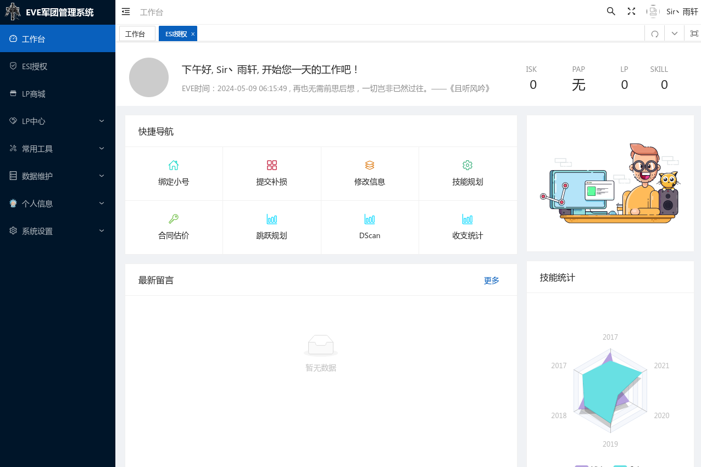
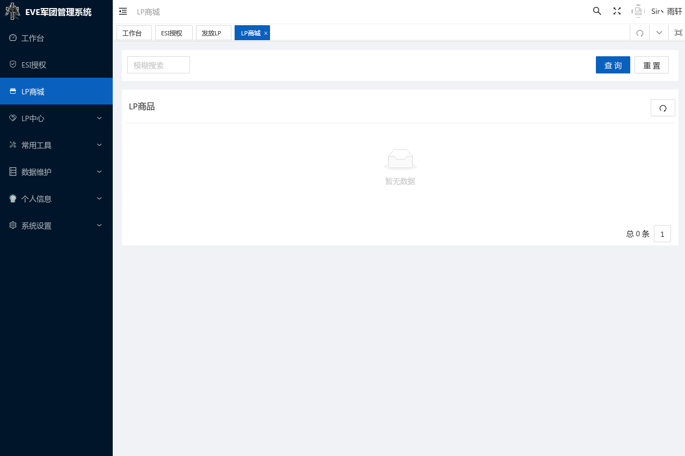
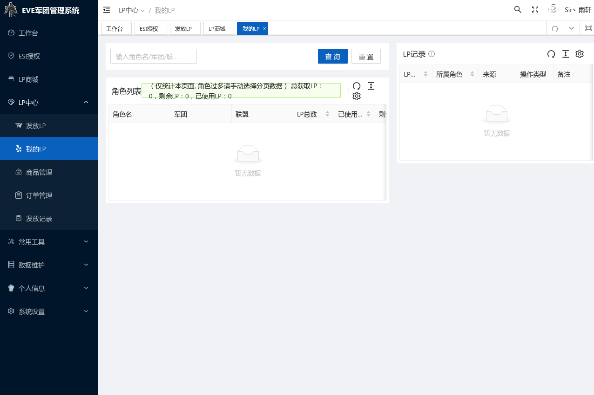
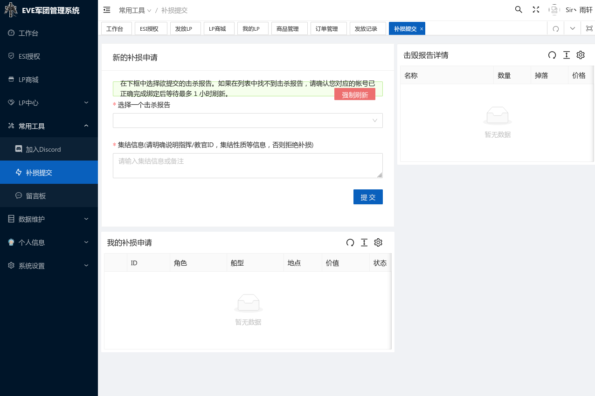
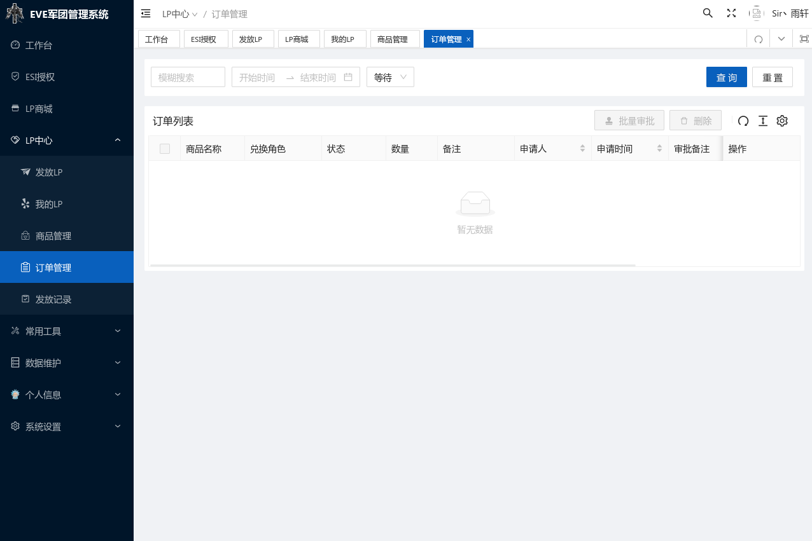
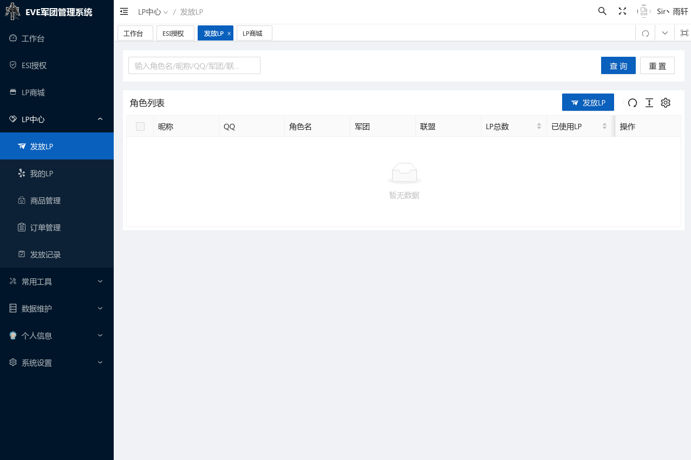
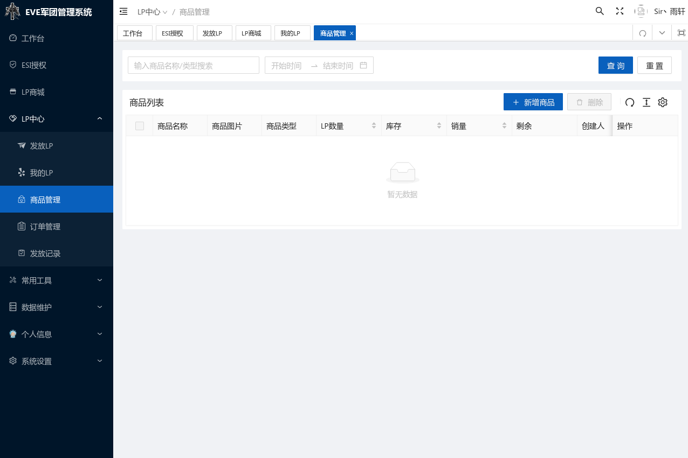
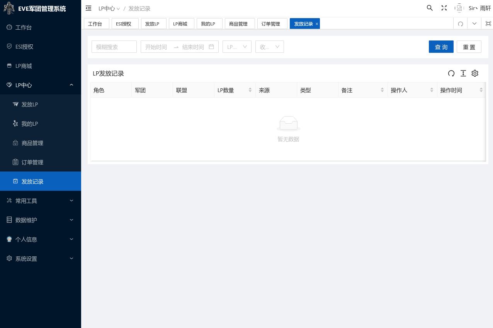
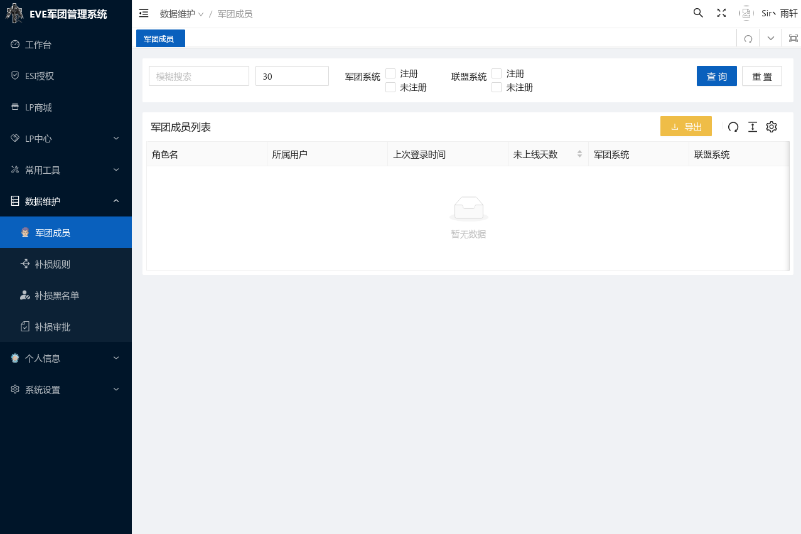
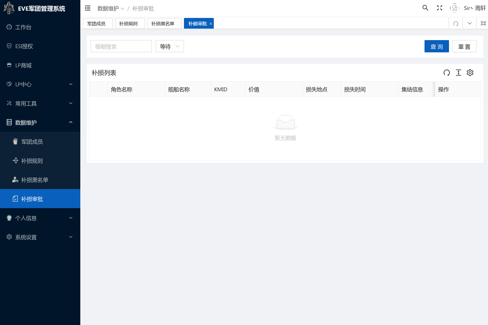

# TITAN_LEGION

## 界面设计

### 已登录用户权限页面

- `登录页面`
  

> 登录操作采用SSO单点登录，登录成功后会自动跳转到用户默认首页，因此前端只需放置一个包含超链接的登录按钮即可。

- `用户默认首页`
  

> 用户若未登录，访问任何页面都会被重定向到登录页面。登录成功后，会自动跳转到用户默认首页，
> 用户默认首页包含了用户的基本信息（用户名、PAP、isk、LP、skill），以及用户的权限信息，根据用户的权限信息，显示不同的功能模块。
> 普通用户可以看到的功能模块有：LP商城、我的LP、补损提交、订单管理。
> 管理员可以看到的功能模块有：发放LP、商品管理、订单管理、发放记录、军团成员、补损审批。
> 注销链接（localhost:8000/logout/）

- `LP商城页面`
  

> LP商城页面展示了所有的商品信息，包括商品名称、商品价格、商品描述、商品图片、购买按钮（用户可以一次购买多个`同类商品`）。
> 用户可以通过购买按钮购买商品，购买成功后，会扣除用户的LP，同时生成一个订单。

- `我的LP页面`
  

> 我的LP页面展示了用户的LP信息，包括历史以来已使用的LP总数、当前剩余的LP总数。

- `补损提交页面`
  

> 用户可以在此界面通过复选框选择一个击杀记录，而后填写补损说明，提交补损申请。

- `订单管理页面`
  

> 此页面显示该用户关于LP兑换商品的订单信息，包括订单号、订单创建时间、订单状态、消耗的LP、兑换的商品名、兑换的商品单价、兑换的商品数量、发起人昵称、发起人用户名。
> 用户可以通过订单状态筛选订单，订单状态有：`通过`、`拒绝`、`待审批`。

### 管理员权限页面

- `发放LP页面`
  

> 管理员可以在此页面看见全部用户的昵称、用户名、目前剩余的LP总数，并通过勾选一个或多个用户，为其发放指定数量的LP。

- `商品管理页面`
  

> 管理员可以在此页面看见所有商品的名称、价格、描述、图片，每个商品的操作按钮有：编辑、删除。并且可以通过新增商品按钮添加新的商品。

- `发放记录页面`
  

> 此页面显示所有关于LP兑换商品的订单信息，包括订单号、订单创建时间、订单状态、消耗的LP、兑换的商品名及其数量、发起人昵称、发起人用户名。
> 管理员可以通过订单状态筛选订单，订单状态有：`通过`、`拒绝`、`待审批`。
> 管理员可以勾选一个或多个订单，并使用`通过`按钮或`拒绝`按钮，对订单进行审批。

- `军团成员页面`
  

> 此页面显示了军团成员的昵称、用户名、PAP、isk、LP、skill，
> 管理员可以通过勾选一个或多个用户，将其踢出军团。
> 管理员可以选择一个用户，编辑其昵称、LP。

- `补损审批页面`
  

> 此页面显示了所有用户提交的补损申请，包括申请编号、申请时间、申请人昵称、申请人用户名、击杀记录、补损说明。
> 管理员可以通过补损状态筛选补损申请，补损状态有：`通过`、`拒绝`、`待审批`。
> 管理员可以通过勾选一个或多个申请，使用`通过`按钮或`拒绝`按钮，对补损申请进行审批。

## 模块设计

### 用户模块

- 增加用户 （`登录页面`-注册即增加用户）
- 删除用户 （`军团成员页面`-管理员将用户踢出军团）
- 查询用户 （`军团成员页面`-显示军团成员信息）
- 修改用户 （`军团成员页面`-管理员修改成员昵称）

### LP模块

- 增加LP （`发放LP页面`-管理员为用户发放LP；后端PAP自动转换LP）
- 删除LP （`LP商城页面`-用户购买商品）
- 查询LP （`我的LP页面`-显示用户LP信息）
- 修改LP （`军团成员页面`-管理员修改成员LP）

### 商品模块

- 增加商品 （`商品管理页面`-管理员添加新商品）
- 删除商品 （`商品管理页面`-管理员删除商品）
- 查询商品 （`LP商城页面`-显示商品信息；`商品管理页面`-显示已有商品信息）
- 修改商品 （`商品管理页面`-管理员编辑商品信息）

### 订单模块

- 增加订单 （`LP商城页面`-用户购买商品生成订单）
- 查询订单 （`订单管理页面`-显示用户订单信息；`发放记录页面`-显示订单信息）
- 修改订单 （`发放记录页面`-管理员审批订单，修改订单状态）

### 补损模块

- 增加补损申请 （`补损提交页面`-用户提交补损申请）
- 查询补损申请 （`补损审批页面`-显示补损申请信息）
- 修改补损申请 （`补损审批页面`-管理员审批补损申请，修改补损申请状态）

## 实体设计

### 用户 `profile`

- `id` 用户ID `int` （`pk`）
- `character_id` 角色ID `int` （唯一值）
- `nickname` 昵称 `str` （用户自定义）
- `pap` 联盟贡献度 `float` （直接来自联盟接口）
- `isk` 游戏角色金额 `float` （直接来自游戏角色属性）
- `skill` 游戏角色技能点 `float` （直接来自游戏角色属性）
- `lp` 军团贡献度 `float` （用户剩余的LP总数，初始为`0`，可小于`0`）
- `used_lp` 已使用的LP总数 `float` （初始为`0`，不可小于`0`）
- `role` 用户角色 `str` （普通用户：`0`，管理员：`1`，储存在表`auth_user`中，名为`is_staff`）
- `user_id` 关联表`auth_user`的`user`的`id` `int` （外键）

### 商品 `item`

- `id` 商品ID `int` （`pk`）
- `item_name` 商品名称 `str` （唯一值）
- `item_price` 商品价格 `float （不可小于`0`）
- `item_description` 商品描述 `str` （商品的详细描述）
- `item_image` 商品图片 `url` （商品的图片链接）

### 订单 `order`

- `id` 订单ID `int` （`pk`）
- `order_id` 订单号 `str` （唯一值）
- `order_time` 订单创建时间 `str` （订单创建的时间）
- `order_status` 订单状态 `str` （通过：`true`、拒绝：`false`、待审批：`none`）
- `lp_cost` 消耗的LP `float` （不可小于`0`）
- `item_name` 兑换的商品名 `str` （不可为空）
- `item_quantity` 兑换的商品数量 `int` （不可小于`0`）
- `nickname` 发起人昵称 `str` （订单发起人的昵称）
- `username` 发起人用户名 `str` （订单发起人的用户名）

### 补损申请 `apply`

- `id` 申请ID `int` （`pk`）
- `apply_id` 申请编号 `str` （唯一值）
- `apply_time` 申请时间 `str` （申请创建的时间）
- `apply_status` 申请状态 `str` （通过：`true`、拒绝：`false`、待审批：`none`）
- `nickname` 申请人昵称 `str` （申请人的昵称）
- `username` 申请人用户名 `str` （申请人的用户名）
- `kill_record` 击杀记录 `dict` （字典类型，用户提交的击杀记录）
    - `kill_kmid` 击杀记录ID `str` （击杀记录的ID）
    - `kill_time` 击杀时间 `str` （击杀时间）
    - `kill_ship` 击杀船型 `str` （击杀船名）
    - `kill_value` 击杀价值 `float` （击杀价值）
    - `kill_location` 击杀地点 `str` （击杀地点）
- `apply_description` 补损说明 `str` （用户填写的补损说明）

## 接口设计（测试前缀`localhost:8000`）

### 上传图片
- 上传图片
    - `/upload_image/` `POST`
    - 权限：管理员
    - 输入：`file`（图片文件，png/jepg）
    - 输出：`url`（图片链接）
    - 输出：{'error': 'Invalid form'}
    - 输出：{'error': 'Invalid request method'}

### 用户模块

- 获取当前用户信息
    - `/get_current_user/` `GET`
    - 权限：普通用户、管理员
    - 输入：无
    - 输出：{`username`, `profile`}
- 获取全部用户信息
    - `/api/profiles/` `GET`
    - 权限：普通用户、管理员
    - 输入：无
    - 输出：List(`profile`)
- 获取指定用户信息
    - `/api/profiles/<pk>/` `GET`
    - 权限：普通用户、管理员
    - 输入：无
    - 输出：`profile`
    - 输出：{"detail":"No Profile matches the given query."} 
    - 输出：{"detail":"未找到。"}
- 修改用户属性
    - `/api/profiles/<pk>/` `PUT`
    - 权限：普通用户、管理员
    - 输入：`profile`（必须包含`nickname`和`user_id`）
    - 输出：`profile`
    - 输出：{"detail":"No Profile matches the given query."}（`pk`值未匹配到）
    - 输出：{"detail":"未找到。"}（`pk`字段不合规范）
    - 输出：{"nickname":["该字段是必填项。"]}（输入不合规范）
    - 输出：{"user_id":["该字段是必填项。"]}
    - 输出：{"used_lp":["请填写合法的数字。"]}（`pap`, `isk`, `skill`, `lp`, `used_lp`）
- 删除用户
    - `/api/profiles/<pk>/` `DELETE`
    - 权限：管理员
    - 输入：无
    - 输出：{"detail":"方法 “DELETE” 不被允许。"}（未填写`pk`）
    - 输出：{"detail":"No Profile matches the given query."}（`pk`值未匹配到）
    - 输出：{"detail":"未找到。"}（`pk`字段不合规范）

### 商品模块

- 获取全部商品信息
  - `/api/items/` `GET`
  - 权限：普通用户、管理员
  - 输入：无
  - 输出：List(`item`)
  - 输出：{`message`: }
- 增加一个商品信息
  - `/api/items/` `POST`
  - 权限：管理员
  - 输入：`item` {`item_name`, `item_price`(浮点型字符串，范围[0, 999]), `item_description`, `item_image`}
  - 输出：`item`
  - 输出：{"item_price": ["`item_price`: 超出范围[0, 999]！"]}
- 删除指定商品信息
  - `/api/items/<pk>/` `DELETE`
  - 权限：管理员
  - 输入：无
  - 输出：{`message`: }
- 修改指定商品信息
  - `/api/items/<pk>/` `PUT`
  - 权限：管理员
  - 输入：`item` （必须包含`item_name`）
  - 输出：`item`
  - 输出：{`message`: }

### 订单模块

- 获取指定用户订单信息
    - `/api/orders/get_user_order_info/` `GET`
    - 权限：普通用户、管理员
    - 输入：`username`
    - 输出：`result`: true, `message`: "
      获取成功", `data`{`order`{`order_id`, `order_time`, `order_status`, `lp_cost`, `item_name`, `item_price`, `item_quantity`, `nickname`, `username`}, ...}
    - 输出：`result`: false, `message`: "获取失败", `data`: {}
- 获取全部订单信息
    - `/api/orders/get_all_order_info/` `GET`
    - 权限：管理员
    - 输入：无
    - 输出：`result`: true, `message`: "
      获取成功", `data`{`order`{`order_id`, `order_time`, `order_status`, `lp_cost`, `item_name`, `item_price`, `item_quantity`, `nickname`, `username`}, ...}
    - 输出：`result`: false, `message`: "获取失败", `data`: {}
- 新建订单
    - `/api/orders/add_order/` `POST`
    - 权限：普通用户，管理员
    - 输入：`username`, `lp_cost`(浮点型字符串，范围[0, 999]，且不得超过用户当前`lp`), `item_name`, `item_quantity`(
      整型字符串，范围[1, 999])
    - 输出：`result`: true, `message`: "添加成功", `data`: {`order`{`order_id`, `order_time`, `order_status`:
      none, `lp_cost`, `item_name`,`item_price`,  `item_quantity`, `nickname`, `username`}, `user`{`lp`, `used_lp`}}
      （新建订单后，在后端更新用户`lp`和`used_lp`）
    - 输出：`result`: false, `message`: "添加失败", `data`: {}
    - 输出: {"lp_cost": ["`lp_cost`: 超出范围[0, 999]！"]}
    - 输出: {"item_quantity": ["`item_quantity`: 超出范围[1, 999]！"]}
- 修改订单状态
    - `/api/orders/update_order_status/` `POST`
    - 权限：管理员
    - 输入：{`order`{`order_id`, `order_status`(通过：`true`，拒绝：`false`，待审批：`none`)}, ...}
    - 输出：`result`: true, `message`: "修改成功", `data`: {`order`{`order_id`, `order_status`}, ...}
    - 输出：`result`: false, `message`: "修改失败", `data`: {}

### 补损模块

- 获取指定用户击杀记录
- `/api/applies/get_user_kill_record/` `GET`
    - 权限：普通用户、管理员
    - 输入：`username`
    - 输出：`result`: true, `message`: "
      获取成功", `data`{`kill_record`{`kill_kmid`, `kill_time`, `kill_ship`, `kill_value`, `kill_location`}, ...}
    - 输出：`result`: false, `message`: "获取失败", `data`: {}
- 获取指定用户补损申请信息
    - `/api/applies/get_user_apply_info/` `GET`
    - 权限：普通用户、管理员
    - 输入：`username`
    - 输出：`result`: true, `message`: "
      获取成功", `data`{`apply`{`apply_id`, `apply_time`, `apply_status`, `nickname`, `username`, `kill_record`, `apply_description`}, ...}
    - 输出：`result`: false, `message`: "获取失败", `data`: {}
- 获取全部补损申请信息
    - `/api/applies/get_all_apply_info/` `GET`
    - 权限：管理员
    - 输入：无
    - 输出：`result`: true, `message`: "
      获取成功", `data`{`apply`{`apply_id`, `apply_time`, `apply_status`, `nickname`, `username`, `kill_record`, `apply_description`}, ...}
    - 输出：`result`: false, `message`: "获取失败", `data`: {}
- 新建补损申请
    - `/api/applies/add_apply/` `POST`
    - 权限：普通用户，管理员
    -
    输入：`username`, `kill_record`{`kill_kmid`, `kill_time`, `kill_ship`, `kill_value`, `kill_location`}, `apply_description`
    - 输出：`result`: true, `message`: "添加成功", `data`: {`apply`{`apply_id`, `apply_time`, `apply_status`:
      none, `nickname`, `username`, `kill_record`, `apply_description`}}
    - 输出：`result`: false, `message`: "添加失败，已经申请过此损失", `data`: {}
- 修改补损申请状态
    - `/api/applies/update_apply_status/` `POST`
    - 权限：管理员
    - 输入：{`apply`{`apply_id`, `apply_status`(通过：`true`，拒绝：`false`，待审批：`none`)}, ...}
    - 输出：`result`: true, `message`: "修改成功", `data`: {`apply`{`apply_id`, `apply_status`}, ...}
    - 输出：`result`: false, `message`: "修改失败", `data`: {}