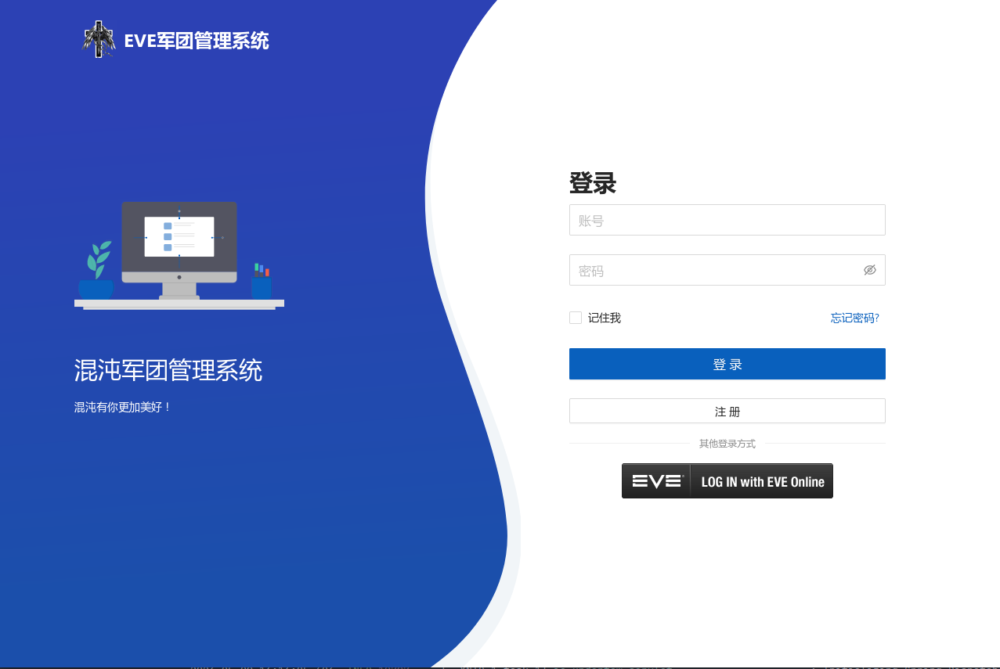

# TITAN_LEGION

## 界面设计

### 已登录用户权限页面
- `登录页面`
 
> 登录操作采用SSO单点登录，登录成功后会自动跳转到用户默认首页，因此前端只需放置一个包含超链接（localhost:8000/social-auth/login/eveonline/）的登录按钮即可。
- `用户默认首页`

> 用户若未登录，访问任何页面都会被重定向到登录页面。登录成功后，会自动跳转到用户默认首页，
> 用户默认首页包含了用户的基本信息（用户名、PAP、isk、LP、skill），以及用户的权限信息，根据用户的权限信息，显示不同的功能模块。
> 普通用户可以看到的功能模块有：LP商城、我的LP、补损提交、订单管理。
> 管理员可以看到的功能模块有：发放LP、商品管理、订单管理、发放记录、军团成员、补损审批。
> 注销链接（localhost:8000/accounts/logout/）
- `LP商城页面`

> LP商城页面展示了所有的商品信息，包括商品名称、商品价格、商品描述、商品图片、购买按钮（用户可以一次购买多个同类商品）。
> 用户可以通过购买按钮购买商品，购买成功后，会扣除用户的LP，同时生成一个订单。
- `我的LP页面`

> 我的LP页面展示了用户的LP信息，包括历史以来已使用的LP总数、当前剩余的LP总数。
- `补损提交页面`

> 用户可以在此界面通过复选框选择一个击杀记录，而后填写补损说明，提交补损申请。
- `订单管理页面`

> 此页面显示该用户关于LP兑换商品的订单信息，包括订单号、订单创建时间、订单状态、消耗的LP、兑换的商品名及其数量、发起人昵称、发起人用户名。
> 用户可以通过订单状态筛选订单，订单状态有：`通过`、`拒绝`、`待审批`。
### 管理员权限页面
- `发放LP页面`

> 管理员可以在此页面看见全部用户的昵称、用户名、目前剩余的LP总数，并通过勾选一个或多个用户，为其发放指定数量的LP。
- `商品管理页面`

> 管理员可以在此页面看见所有商品的名称、价格、描述、图片，每个商品的操作按钮有：编辑、删除。并且可以通过新增商品按钮添加新的商品。
- `发放记录页面`

> 此页面显示所有关于LP兑换商品的订单信息，包括订单号、订单创建时间、订单状态、消耗的LP、兑换的商品名及其数量、发起人昵称、发起人用户名。
> 管理员可以通过订单状态筛选订单，订单状态有：`通过`、`拒绝`、`待审批`。
> 管理员可以勾选一个或多个订单，并使用`通过`按钮或`拒绝`按钮，对订单进行审批。
- `军团成员页面`

> 此页面显示了军团成员的昵称、用户名、PAP、isk、LP、skill，
> 管理员可以通过勾选一个或多个用户，将其踢出军团。
> 管理员可以选择一个用户，编辑其昵称、LP。
- `补损审批页面`

> 此页面显示了所有用户提交的补损申请，包括申请编号、申请时间、申请人昵称、申请人用户名、击杀记录、补损说明。
> 管理员可以通过补损状态筛选补损申请，补损状态有：`通过`、`拒绝`、`待审批`。
> 管理员可以通过勾选一个或多个申请，使用`通过`按钮或`拒绝`按钮，对补损申请进行审批。

## 模块设计

### 用户模块
- 增加用户 （`登录页面`-注册即增加用户）
- 删除用户 （`军团成员页面`-管理员将用户踢出军团）
- 查询用户 （`军团成员页面`-显示军团成员信息）
- 修改用户 （`军团成员页面`-管理员修改成员昵称）

### LP模块
- 增加LP （`发放LP页面`-管理员为用户发放LP；后端PAP自动转换LP）
- 删除LP （`LP商城页面`-用户购买商品）
- 查询LP （`我的LP页面`-显示用户LP信息）
- 修改LP （`军团成员页面`-管理员修改成员LP）

### 商品模块
- 增加商品 （`商品管理页面`-管理员添加新商品）
- 删除商品 （`商品管理页面`-管理员删除商品）
- 查询商品 （`LP商城页面`-显示商品信息；`商品管理页面`-显示已有商品信息）
- 修改商品 （`商品管理页面`-管理员编辑商品信息）

### 订单模块
- 增加订单 （`LP商城页面`-用户购买商品生成订单）
- 查询订单 （`订单管理页面`-显示用户订单信息；`发放记录页面`-显示订单信息）
- 修改订单 （`发放记录页面`-管理员审批订单，修改订单状态）

### 补损模块
- 增加补损申请 （`补损提交页面`-用户提交补损申请）
- 查询补损申请 （`补损审批页面`-显示补损申请信息）
- 修改补损申请 （`补损审批页面`-管理员审批补损申请，修改补损申请状态）

## 实体设计（不包含`id`）

### 用户
- `username` 用户名 `str` （唯一值，直接来自游戏角色属性）
- `nickname` 昵称 `str` （用户自定义）
- `pap` 联盟贡献度 `str` （直接来自联盟接口）
- `isk` 游戏角色金额 `str` （直接来自游戏角色属性）
- `skill` 游戏角色技能点 `str` （直接来自游戏角色属性）
- `lp` 军团贡献度 `str` （用户剩余的LP总数，初始为0，不可小于0）
- `used_lp` 已使用的LP总数 `str` （初始为0，不可小于0）
- `role` 用户角色 `str` （普通用户、管理员）

### 商品
- `item_name` 商品名称 `str` （唯一值）
- `item_price` 商品价格 `str` （不可小于0）
- `item_description` 商品描述 `str` （商品的详细描述）
- `item_image` 商品图片 `str` （商品的图片链接）

### 订单
- `order_id` 订单号 `str` （唯一值）
- `order_time` 订单创建时间 `str` （订单创建的时间）
- `order_status` 订单状态 `str` （通过、拒绝、待审批）
- `lp_cost` 消耗的LP `str` （不可小于0）
- `item_name` 兑换的商品名 `str` （不可为空）
- `item_quantity` 兑换的商品数量 `str` （不可小于0）
- `nickname` 发起人昵称 `str` （订单发起人的昵称）
- `username` 发起人用户名 `str` （订单发起人的用户名）

### 补损申请
- `apply_id` 申请编号 `str` （唯一值）
- `apply_time` 申请时间 `str` （申请创建的时间）
- `apply_status` 申请状态 `str` （通过、拒绝、待审批）
- `nickname` 申请人昵称 `str` （申请人的昵称）
- `username` 申请人用户名 `str` （申请人的用户名）
- `kill_record` 击杀记录 `dict` （字典类型，用户提交的击杀记录）
  - `kill_kmid` 击杀记录ID `str` （击杀记录的ID）
  - `kill_time` 击杀时间 `str` （击杀时间）
  - `kill_ship` 击杀船型 `str` （击杀船名）
  - `kill_value` 击杀价值 `str` （击杀价值）
  - `kill_location` 击杀地点 `str` （击杀地点）
- `apply_description` 补损说明 `str` （用户填写的补损说明）

## 接口设计
### 用户默认首页
- 获取用户基本信息
  - `TODO`